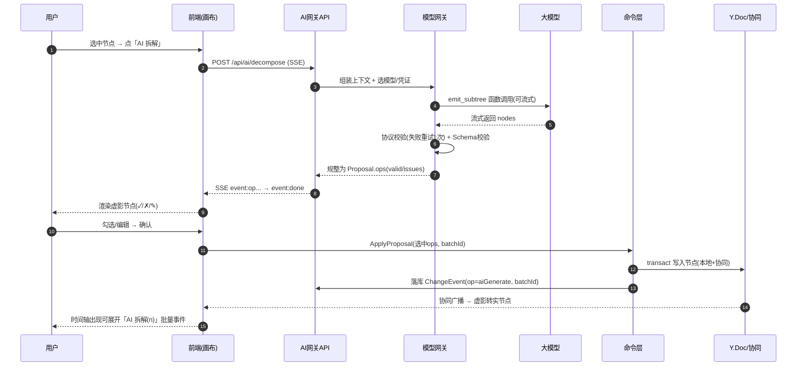

# AI 拆解 · 详细设计

> 配套主文档 `../思谱-需求文档.md` 第 4 章 F2、第 5.5 节。本篇细化 AI 能力的提示词、输出契约、上下文组装、校验重试与数据流。

| 项 | 内容 |
|----|------|
| 版本 | v0.1 |
| 日期 | 2026-05-30 |
| 关联 | F2 AI 拆解、5.5 模型网关、A6 计费 |
| 排期 | 能力1+摘要 M2；对话式/补全/查重/改写 M4 |

---

## 1. 能力总览

模型网关对上暴露 4 个能力，对下适配多模型（OpenAI 兼容协议优先）。

| 能力 | 接口 | 输入 | 输出 | 排期 |
|------|------|------|------|------|
| 生成子树 | `decompose` | 节点 + 上下文 + 目标类型 + 层数 + 提示 | 结构化子树（待预览） | M2 |
| 总结 | `summarize` | 节点/子树/时间区间 | 摘要文本 | M2 |
| 对话式增量 | `converse` | 自然语言指令 + 当前选区上下文 | 一组增量操作（待预览） | M4 |
| 补全/查重 | `complete` | 兄弟/子节点集合 | 缺失项建议 + 重复/可合并建议 | M4 |
| 改写 | `rewrite` | 节点正文 + 风格指令 | 改写后文本 | M4 |

**统一原则**：凡是会**改变树结构/内容**的能力（decompose / converse / complete），其输出一律是「**建议（proposal）**」，必须经用户 diff 预览确认后，才由命令层写入文档；不直接落库。`summarize`/`rewrite` 产出文本，由用户决定是否采用。

---

## 2. 上下文组装（Context Builder）

拆解质量取决于喂给模型的上下文。组装器从 Yjs 文档只读快照提取，**控制 token 预算**（按模型上下文窗口动态裁剪）。

### 2.1 上下文结构

```jsonc
{
  "target": {                      // 当前选中节点
    "id": "n_42",
    "type": "task",
    "title": "完成支付模块",
    "data": { "priority": "高", "desc": "..." }
  },
  "ancestors": [                   // 从根到父的路径（父链），仅标题+类型
    { "id": "n_1", "type": "objective", "title": "Q3 上线新版" },
    { "id": "n_8", "type": "requirement", "title": "支付能力" }
  ],
  "siblings": [                    // 同级兄弟，仅标题（去重/查漏用）
    { "id": "n_40", "title": "对接微信支付" },
    { "id": "n_41", "title": "对接支付宝" }
  ],
  "children": [                    // 已有子节点标题（避免重复生成）
    { "id": "n_50", "title": "接口联调" }
  ],
  "targetSchema": { /* 目标类型的字段定义，见主文档 3.3 */ },
  "userPrompt": "按后端开发任务拆，强调测试",
  "options": { "depth": 1, "maxChildren": 8, "lang": "zh" }
}
```

### 2.2 裁剪策略（token 预算）

优先级从高到低保留：`target` > `targetSchema` > `userPrompt` > `ancestors`（仅标题）> `children`（去重必需）> `siblings`。超预算时：

1. 兄弟节点超过 N 个 → 只取最近编辑的 N 个标题；
2. 父链过深 → 保留根 + 直接父 + 省略中间（标注 `…省略 k 层…`）；
3. `data` 富文本字段过长 → 截断并标注。

---

## 3. 提示词模板（Prompt Templates）

采用 **system + user** 双段；结构化输出走 **function calling / JSON mode**，禁止自由文本夹带。

### 3.1 generate子树 · system

```
你是结构化拆解助手。根据「目标节点」及其上下文，把它拆解为更细的子节点。
规则：
1. 只输出子节点，不重复已有子节点（children 列表）。
2. 每个子节点必须符合 targetSchema 的字段定义；枚举字段只能取 options 内的值。
3. 数量不超过 options.maxChildren；层数不超过 options.depth。
4. 子节点之间应 MECE（相互独立、完全穷尽），避免与 siblings 语义重叠。
5. 用 options.lang 指定的语言；标题简洁（≤ 20 字），描述可展开。
6. 通过 emit_subtree 函数返回，不要输出任何额外文字。
```

### 3.2 generate子树 · user

```
目标节点：{{target.title}}（类型：{{target.type}}）
上级路径：{{ancestors as 标题链}}
同级已有：{{siblings.titles}}
已有子节点（勿重复）：{{children.titles}}
目标子节点类型 Schema：{{targetSchema}}
补充要求：{{userPrompt}}
```

### 3.3 函数定义（emit_subtree）

```jsonc
{
  "name": "emit_subtree",
  "description": "返回拆解出的子节点（可含多层）",
  "parameters": {
    "type": "object",
    "required": ["nodes"],
    "properties": {
      "nodes": {
        "type": "array",
        "items": { "$ref": "#/$defs/node" }
      }
    },
    "$defs": {
      "node": {
        "type": "object",
        "required": ["title", "type"],
        "properties": {
          "title": { "type": "string", "maxLength": 60 },
          "type": { "type": "string" },          // 必须是已存在的 typeKey
          "data": { "type": "object" },           // 须符合该 type 的字段定义
          "children": {                            // 递归，支持多层
            "type": "array",
            "items": { "$ref": "#/$defs/node" }
          }
        }
      }
    }
  }
}
```

> 实现要点：`data` 的精确校验无法完全靠 JSON Schema 表达（依赖 type 动态决定），故二次校验在服务端做（见第 5 节）。

---

## 4. JSON 输出契约（Proposal）

模型返回 → 网关规整为统一 **Proposal** 结构，前端据此渲染 diff 预览：

```jsonc
{
  "proposalId": "prop_xxx",
  "capability": "decompose",
  "mapId": "m_1",
  "anchorNodeId": "n_42",          // 挂载锚点
  "batchId": "b_xxx",              // 接受后写入 ChangeEvent 的批次号
  "ops": [                          // 规整为「拟新增/修改」的扁平操作
    {
      "tempId": "t1",               // 预览期临时 id
      "op": "addChild",
      "parentRef": "n_42",          // 真实父 id 或上一个 tempId
      "node": { "type": "task", "title": "接口设计", "data": { "priority": "中" } },
      "valid": true,
      "issues": []                  // 校验问题（见第5节）
    },
    {
      "tempId": "t2",
      "op": "addChild",
      "parentRef": "t1",            // 第二层挂在 t1 下
      "node": { "type": "task", "title": "单元测试", "data": {} },
      "valid": true,
      "issues": []
    }
  ],
  "modelMeta": { "provider": "qwen", "model": "qwen-max", "tokens": { "in": 1200, "out": 800 } }
}
```

**对话式/补全**复用同一 Proposal，区别在 `ops` 可含 `addChild` / `addSibling` / `updateField` / `merge` / `delete`（删/改也需预览）。

---

## 5. 校验与重试降级（Validation & Fallback）

```
模型返回
  │
  ▼
① 协议校验：是否调用了 emit_* 函数 / 是否合法 JSON
  │ 失败 → 重试1次（追加“必须用函数返回”提示）
  ▼
② Schema 校验：逐节点比对 targetSchema
  - type 是否存在
  - 必填字段是否齐全（缺失→填 default，无 default 标 issue）
  - enum 值是否在 options 内（越界→就近修正或标 issue）
  - 类型转换（"3"→3 等宽松转换）
  │ 部分失败 → 不整体丢弃；问题节点 valid:false + issues 列出，仍进预览
  ▼
③ 业务约束：数量/层数上限、与 children 标题查重（重复→标记可跳过）
  ▼
生成 Proposal（valid 节点默认勾选，invalid 节点默认不勾选但可手动修复）
```

**重试策略**：协议级失败重试 1 次；Schema 级不重试（交人工 diff 处理，避免成本与延迟翻倍）。**降级**：所选模型不支持 function calling → 退化为 JSON mode + 文本解析；都不支持 → 提示用户更换模型。

---

## 6. 流式与中断

- `decompose`/`summarize` 经 **SSE** 向前端流式返回：
  - `summarize`：逐 token 流式追加文本。
  - `decompose`：支持流式 partial（边生成边在预览面板出现子节点占位），也可整批返回（取决于模型是否支持流式函数调用；不支持则整批）。
- 用户可**中断**：前端断开 SSE，服务端取消上游请求（透传 abort）。
- 超时：默认首字 8s、总时长 60s（可配），超时给可读错误 + 重试按钮。

---

## 7. diff 预览数据流（前端）

```
用户点「AI 拆解」
  → POST /api/ai/decompose (SSE)
  → 流式收 Proposal.ops
  → 在画布以「虚影节点」渲染（半透明、带 ✓/✗/✎ 角标）
  → 用户操作：
       ✓ 接受单个 / ✗ 拒绝 / ✎ 就地编辑 / 「全部接受」/「全部拒绝」
  → 确认 →
       命令层把勾选 ops 转为真实命令（CreateNode…），同一 batchId
       Yjs 事务写入 + 产出 ChangeEvent(op=aiGenerate, batchId)
  → 虚影转实节点；时间轴出现一条可展开的「AI 拆解（n 个节点）」批量事件
```

**关键**：未确认前不进入 Yjs 文档，因此**不参与协同同步**（避免他人看到未确认的虚影）；预览态是本地 UI 状态。

---

## 8. 与计费/网关（A6）

- 每次调用记 `tokens.in/out` + `provider/model` → 计量表（按 tenant/project）。
- 来源选择：租户配置「平台默认额度」或「自带 Key」；网关按租户路由到对应凭证。
- 私有部署：可指向自托管模型（vLLM 等）或客户 Key；无外网时禁用平台额度模式。

---

## 9. 验收标准

- 生成子树结果 100% 经预览，未确认不写入文档、不参与协同同步。
- 上下文请求中可验证包含父链标题与兄弟标题（日志可查）。
- 模型输出不合 Schema 时：协议级自动重试 1 次；Schema 级问题节点进预览并标 issue，不破坏现有树。
- 一次生成 N 个节点在时间轴折叠为 1 条 `aiGenerate` 批量事件，可展开。
- 流式可中断，中断后上游请求被取消。

---

## 10. 待定/风险

- 流式函数调用各家支持不一 → 网关探测能力，不支持则整批返回。
- 多层拆解（depth>1）token 与质量权衡 → 默认 depth=1，深拆建议分多次。
- `data` 复杂字段（richtext）由模型生成的质量 → 首版只让模型填结构字段与简短描述，长正文留人工。

---

## 11. 待定点敲定（原 §10）

| 原待定 | 敲定结论 |
|--------|----------|
| 流式函数调用各家支持不一 | 网关启动探测每模型能力标志 `{stream, functionCall, jsonMode}`。`decompose` 优先 `stream+functionCall`；无 functionCall → 降级 jsonMode + 解析；无 stream → 整批返回，前端显示「生成中」loading（非逐节点虚影）。 |
| 多层拆解 token/质量 | 默认 `depth=1, maxChildren=8`；允许 `depth≤3`，但 `depth>1` 强制「整批返回 + 一次性预览」并提示成本上升；超 maxChildren 截断并提示。 |
| richtext 生成质量 | 首版 AI 仅生成 `title` + 结构字段（enum/number/date）+ ≤120 字纯文本短描述写入 `desc`；不生成长富文本，留占位「✨ 待补充」提示人工。 |

## 12. 时序图：生成子树 → 预览 → 接受



## 13. 接口契约

### POST /api/ai/decompose  (SSE)
鉴权：Bearer JWT，需 project 上 role ≥ Editor。

请求体：
```jsonc
{
  "mapId": "m_1",
  "nodeId": "n_42",
  "targetType": "task",        // 可选，缺省=与父同类型或 idea
  "depth": 1,                   // 1..3
  "maxChildren": 8,            // 1..20
  "prompt": "按后端任务拆，强调测试",  // 可选
  "lang": "zh"
}
```
响应：`text/event-stream`
```
event: meta   data: {"proposalId":"prop_x","batchId":"b_x","provider":"qwen","model":"qwen-max"}
event: op     data: {"tempId":"t1","op":"addChild","parentRef":"n_42","node":{...},"valid":true,"issues":[]}
event: op     data: {...}
event: done   data: {"proposalId":"prop_x","stats":{"total":6,"valid":5,"invalid":1,"tokens":{"in":1200,"out":800}}}
event: error  data: {"code":"MODEL_TIMEOUT","message":"...","retryable":true}
```
错误码：400 参数/Schema 校验失败 · 403 权限 · 404 节点不存在 · 429 额度超限 · 502 模型网关失败 · 504 超时。

### ~~POST /api/ai/proposals/:proposalId/apply~~（不提供，与 API契约 §7.1 对齐）
**不提供该服务端端点。** 提案的应用由**前端命令层**完成（`MapRepository.applyProposal` → Y.Doc，同 batchId 产出 `aiGenerate` 事件 → 落 `change_events`）。原因：
- 约定②：命令层是 Y.Doc 唯一写入口，且 Y.Doc 活在 collab+前端进程，api 服务端无法直接写协同文档（返回 `createdNodeIds` 需服务端把节点落进文档，做不到）。
- 提案为前端本地态（`decompose` 经 SSE 流式吐出、不落库，无 `proposals` 表），服务端无法按 `proposalId` 重建 ops。
- 审计已覆盖：命令层 apply 产出的 `aiGenerate` 事件即审计流。

> 若未来需要「服务端编排」（如批量自动应用），须先持久化提案（新建 `ai_proposals` 表）并让 api 作为 Yjs 客户端连 collab 应用命令层——属架构级扩展，非 MVP。

### POST /api/ai/summarize  (SSE)
```jsonc
// 请求 (scope 二选一)
{ "mapId":"m_1", "scope": { "nodeId":"n_42" }, "style":"bullet", "lang":"zh" }
// { "mapId":"m_1", "scope": { "range": { "from":1730000000000, "to":1730600000000 } } }
// 响应: event:delta(逐token文本) → event:done {"summary":"...","tokens":{...}}
```
