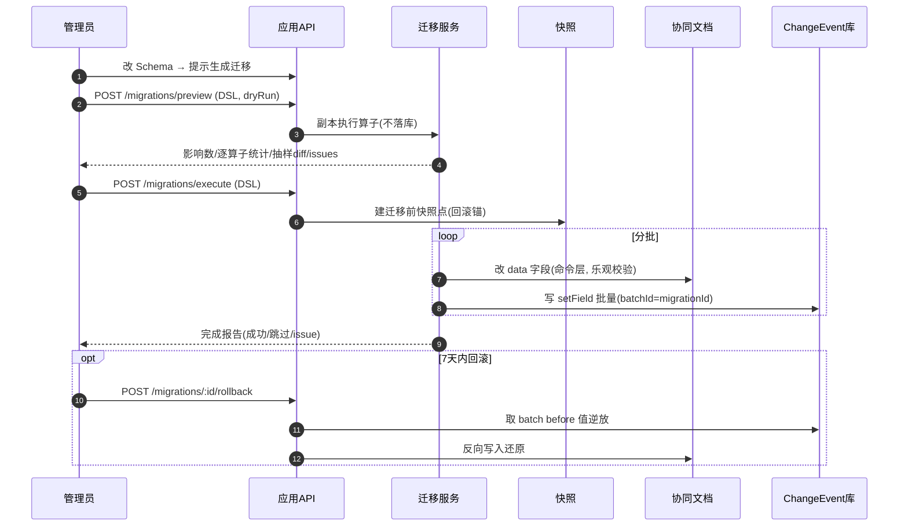

# Schema 迁移工具 · 详细设计

> 配套主文档 `../思谱-需求文档.md` 第 3.3 节、F3、第 9 章 A10（增强项）。本篇细化迁移规则 DSL、算子、预览/执行/回滚流程与字段级变换策略。

| 项 | 内容 |
|----|------|
| 版本 | v0.1 |
| 日期 | 2026-05-30 |
| 关联 | 3.3 Schema、F3 自定义字段、A10 |
| 排期 | M4 |

---

## 1. 背景与目标

节点类型 Schema 可被管理员修改（增删改字段）。默认策略是「**旧值保留 + 标记废弃**」不破坏数据；迁移工具在此之上提供**主动、可控、可回滚**的批量数据变换。

**目标**：让管理员安全地把某节点类型下所有节点的旧数据，按规则迁移到新 Schema 形态；全程可预览影响、可回滚、记入历史。

**非目标**：不做跨类型自动重构；不做无人工确认的强制破坏性迁移。

---

## 2. 触发场景

| Schema 变更 | 默认行为 | 迁移工具可做 |
|-------------|----------|--------------|
| 新增字段 | 节点缺该字段（取 default 或空） | 批量回填默认值/按表达式计算 |
| 删除字段 | 旧值保留 + 标记废弃 | 批量清理废弃字段值 |
| 字段改名 | 视为「删旧+加新」，旧值保留废弃 | 把旧字段值搬到新字段 |
| 类型变更（如 text→enum） | 旧值保留废弃，新字段空 | 按映射/转换规则迁移值 |
| 枚举选项变更 | 越界值保留但失配 | 合并/重映射选项值 |
| 必填新增 | 旧节点缺值 | 批量填默认 + 标记待补 |

---

## 3. 迁移规则 DSL

迁移定义为一个**有序算子列表**，作用于「某 typeKey 的全部节点」（或带过滤条件的子集）。

```jsonc
{
  "migrationId": "mig_xxx",
  "typeKey": "task",
  "fromVersion": 3,
  "toVersion": 4,
  "filter": { "where": "data.legacy == true" },   // 可选，限定子集
  "ops": [
    { "op": "renameField", "from": "desc", "to": "description" },
    { "op": "setDefault",  "field": "priority", "value": "中", "onlyIfEmpty": true },
    { "op": "convertType", "field": "due", "to": "date", "parse": "yyyy/MM/dd" },
    { "op": "mapEnum",     "field": "status",
      "mapping": { "doing": "in_progress", "done": "completed" },
      "fallback": "todo" },
    { "op": "computeField","field": "slug",
      "expr": "lower(replace(title, ' ', '-'))" },
    { "op": "dropField",   "field": "oldFlag" }
  ],
  "dryRun": true
}
```

### 3.1 算子（Operators）

| 算子 | 作用 | 关键参数 |
|------|------|----------|
| `renameField` | 字段改名（值搬移） | from, to |
| `setDefault` | 设默认值 | field, value, onlyIfEmpty |
| `convertType` | 类型转换 | field, to, parse/format, onError(skip\|null\|markIssue) |
| `mapEnum` | 枚举值重映射 | field, mapping, fallback |
| `splitField` | 一拆多（如 "高/紧急"→两字段） | field, by, into[] |
| `mergeFields` | 多合一 | fields[], into, joiner |
| `computeField` | 表达式计算 | field, expr |
| `dropField` | 删除字段值 | field |
| `markDeprecated` | 仅标记废弃不删 | field |

### 3.2 表达式（expr）能力（受限、安全）

- 只读访问：`title`, `data.*`, `type`, `ownerId` 等节点字段。
- 内置函数：`lower/upper/trim/replace/concat/substr/now/coalesce/if`。
- **沙箱执行**：无 IO、无网络、有 CPU/时间上限；禁止任意代码。
- 表达式失败 → 按 `onError` 处理（默认 markIssue，不中断整批）。

---

## 4. 预览 / 执行 / 回滚流程

```
管理员改 Schema → 系统提示「检测到结构变更，是否生成迁移？」
        │
        ▼
   ① 编辑迁移 DSL（可视化表单 或 直接 JSON）
        │
        ▼
   ② 预览（dryRun=true）
        - 在副本上跑算子，不落库
        - 返回：受影响节点数、每算子成功/失败计数、
                抽样 before→after diff、issue 列表
        - 管理员核对，可改算子重新预览
        │
        ▼
   ③ 执行（dryRun=false）
        - 后台任务分批处理（大数据量异步，带进度）
        - 每节点变更经【命令层】产出 ChangeEvent(op=setField, batchId=migrationId)
        - 写入前对该 map 建【迁移前快照点】（回滚锚）
        - typeSchema.version 升到 toVersion
        │
        ▼
   ④ 完成报告：成功 n / 跳过 k / issue m（可导出明细）
        │
        ▼
   ⑤ 回滚（可选，限时窗口内）
        - 依据 batchId 的 ChangeEvent before 值逆向恢复
        - 或回到迁移前快照点（整体回退该批）
        - 回滚本身也记为一批 ChangeEvent(op=setField, 反向)
```

### 4.1 与变更历史集成

- 迁移产生的每条字段变更都是标准 `ChangeEvent`，`batch_id = migrationId`，`actor_id = 执行管理员`。
- 时间轴上折叠为一条「Schema 迁移：task v3→v4（影响 n 节点）」批量事件，可展开看明细。
- 回滚同样可追溯。

### 4.2 回滚两种实现

| 方式 | 原理 | 适用 |
|------|------|------|
| 事件逆放 | 按 batchId 取 ChangeEvent，用 before 逐字段还原 | 精确、可部分回滚 |
| 快照回退 | 回到迁移前 Y.Doc 快照点 | 整体回退、简单但丢迁移后并发编辑 |

> 默认用**事件逆放**（不丢迁移后其他人的正常编辑）；快照回退作为「灾难恢复」兜底。

---

## 5. 并发与一致性

- 执行期对目标类型节点的相关字段写入加**乐观校验**：仅当字段现值 == 预览时记录的旧值才改（否则记 conflict，跳过并报告）→ 避免覆盖迁移期间的并发编辑。
- 幂等：同一 migrationId 重跑只处理未完成节点。
- 大批量：分页 + 限流，避免协同文档瞬时大量 update 冲击。

---

## 6. 权限

- 仅 Owner/Admin 可定义与执行迁移（见权限详设 §2 矩阵）。
- 私有部署/SaaS 一致。
- 迁移影响范围若跨多 map（同类型用于多项目），需逐 map 授权或租户级管理员操作。

---

## 7. 验收标准

- 字段重命名迁移后，所有受影响节点旧值正确出现在新字段，旧字段按配置清理或标废弃。
- 预览（dryRun）不改任何真实数据，且统计与实际执行一致（同输入）。
- 执行中并发编辑某节点该字段 → 该节点记 conflict 跳过，不被覆盖。
- 时间轴出现可展开的迁移批量事件；限时窗口内可回滚且数据正确还原。
- 表达式异常不致整批失败，仅对应节点记 issue。

---

## 8. 待定/风险

- 可视化 DSL 编辑器的复杂度（首版可先支持 JSON + 常用算子表单，复杂表达式后置）。
- `splitField/mergeFields` 等高级算子使用频率低，可按需排期，先交付 rename/setDefault/convertType/mapEnum/dropField 五个高频算子。
- 跨多项目共享类型的迁移授权与批处理规模需在实现时定清。
- 回滚时间窗口长度（如 7 天）与快照保留策略需配置化。

---

## 9. 待定点敲定（原 §8）

| 原待定 | 敲定结论 |
|--------|----------|
| 高级算子排期 | M4 首发 5 个高频算子：`renameField / setDefault / convertType / mapEnum / dropField`；`splitField / mergeFields / computeField` 放 M4.1 或按需开启。 |
| 回滚时间窗口 | 默认迁移批次可回滚 7 天（租户可配 1–30 天）；超窗仅保留快照灾备（只读恢复，丢迁移后并发编辑）。 |
| 跨项目共享类型迁移授权 | 迁移作用域选 typeKey 时列出全部引用项目；执行者须对每个项目有 Admin+；缺权项目跳过并报告，由对应管理员单独执行。 |

## 10. 时序图：预览 → 执行 → 回滚



## 11. 接口契约

### POST /api/schemas/:typeKey/migrations/preview
鉴权：Owner/Admin。
```jsonc
// 请求
{ "fromVersion":3,"toVersion":4,
  "filter": { "where":"data.legacy == true" },
  "ops": [ {"op":"renameField","from":"desc","to":"description"},
           {"op":"mapEnum","field":"status","mapping":{"doing":"in_progress"},"fallback":"todo"} ],
  "dryRun": true }
// 响应 200
{ "affected":126,
  "perOp":[ {"op":"renameField","ok":126,"fail":0},
            {"op":"mapEnum","ok":120,"fail":6} ],
  "samples":[ {"nodeId":"n_1","before":{"status":"doing"},"after":{"status":"in_progress"}} ],
  "issues":[ {"nodeId":"n_9","op":"mapEnum","reason":"值越界→fallback"} ] }
```

### POST /api/schemas/:typeKey/migrations/execute
```jsonc
// 请求 (同 preview 去 dryRun) + 可选 scopeProjectIds
{ "fromVersion":3,"toVersion":4,"ops":[],"scopeProjectIds":["p_1","p_2"] }
// 响应 202
{ "migrationId":"mig_x","status":"running" }
```

### GET /api/schemas/migrations/:migrationId
```jsonc
// 响应 200
{ "migrationId":"mig_x","status":"running|done|failed|rolledback",
  "processed":120,"total":126,
  "result": { "ok":118,"skipped":6,"issues":2 },
  "rollbackableUntil": 1730600000000,
  "skippedProjects":[ {"projectId":"p_3","reason":"无Admin权限"} ] }
```

### POST /api/schemas/migrations/:migrationId/rollback
```jsonc
// 响应 202 { "migrationId":"mig_x","status":"rolling_back","mode":"event_replay|snapshot" }
```
错误：403 权限 · 409 已回滚/超出回滚窗口 · 422 DSL 校验失败（含算子参数错误明细）。
