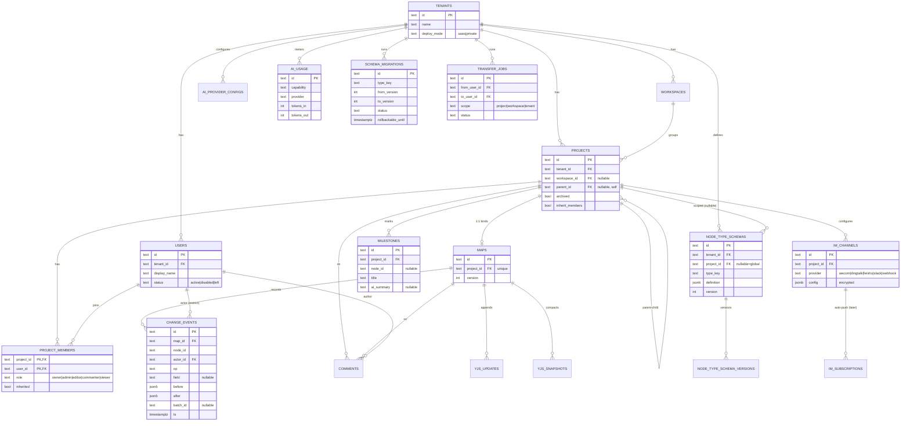

# 思谱 Mindline · 数据模型与 DDL

> 配套 `../思谱-需求文档.md` §3、`API契约总览.md` §11 与四份详设。本篇给出 ER 图与可执行的 PostgreSQL DDL，作为数据库层的单一事实来源。**设计层文档，不含迁移脚本运行**。

| 项 | 内容 |
|----|------|
| 版本 | v0.1 |
| 日期 | 2026-05-30 |
| 目标库 | PostgreSQL 14+ |
| 关联 | 主文档 §3.2 数据表、API契约总览 §11、Yjs协同详设 §7.1、Schema迁移/权限详设 |

---

## 1. 全局约定

| 维度 | 约定 |
|------|------|
| 主键 | `text` 类型，值为 `<前缀>_<ULID>`（如 `u_01HX...`），由**应用层生成**（K-sortable，便于按创建序排序）。前缀见 API契约总览 §1.6。 |
| 时间 | 列用 `timestamptz`，默认 `now()`；API 层序列化为 epoch 毫秒。 |
| 枚举 | 用 `text + CHECK` 约束（加值无需 `ALTER TYPE`，迁移更轻）。 |
| 多租户 | 业务表均含 `tenant_id`；隔离用「应用层强制 + 可选 RLS」（见 §6）。 |
| JSON | 灵活/半结构化数据用 `jsonb`（definition / config / before-after / result 等）。 |
| 协同二进制 | Yjs update/snapshot 用 `bytea`。 |
| 软删除 | 用户用 `status='left'`，项目用 `archived`；历史/事件**不删**以保真。 |
| 级联 | 归属性子表 `ON DELETE CASCADE`；引用「人」的历史列 `ON DELETE RESTRICT`（保真）。 |

---

## 2. ER 图



---

## 3. DDL（建表语句）

> 按依赖顺序排列，可整段执行。每段标注所属里程碑。

### 3.1 租户与用户（M0）

```sql
-- 租户：SaaS 多租户共存；私有部署通常单租户
CREATE TABLE tenants (
  id          text PRIMARY KEY,                          -- tn_<ULID>
  name        text NOT NULL,
  deploy_mode text NOT NULL DEFAULT 'saas'
                CHECK (deploy_mode IN ('saas','private')),
  created_at  timestamptz NOT NULL DEFAULT now()
);

-- 用户：status='left' 表示离职（不物理删除，保历史保真）
CREATE TABLE users (
  id           text PRIMARY KEY,                         -- u_<ULID>
  tenant_id    text NOT NULL REFERENCES tenants(id) ON DELETE CASCADE,
  email        text,
  phone        text,
  display_name text NOT NULL,
  avatar_url   text,
  status       text NOT NULL DEFAULT 'active'
                 CHECK (status IN ('active','disabled','left')),
  created_at   timestamptz NOT NULL DEFAULT now()
);
CREATE UNIQUE INDEX uq_users_email ON users(tenant_id, email) WHERE email IS NOT NULL;
CREATE UNIQUE INDEX uq_users_phone ON users(tenant_id, phone) WHERE phone IS NOT NULL;
```

### 3.2 工作空间、项目、思维导图（M0）

```sql
-- 工作空间：可选层级，用于隔离团队/业务线
CREATE TABLE workspaces (
  id         text PRIMARY KEY,                           -- ws_<ULID>
  tenant_id  text NOT NULL REFERENCES tenants(id) ON DELETE CASCADE,
  name       text NOT NULL,
  created_at timestamptz NOT NULL DEFAULT now()
);

-- 项目：可父子嵌套（parent_id 自引用）；归档而非删除
CREATE TABLE projects (
  id              text PRIMARY KEY,                      -- p_<ULID>
  tenant_id       text NOT NULL REFERENCES tenants(id) ON DELETE CASCADE,
  workspace_id    text REFERENCES workspaces(id) ON DELETE SET NULL,
  parent_id       text REFERENCES projects(id) ON DELETE SET NULL,
  name            text NOT NULL,
  archived        boolean NOT NULL DEFAULT false,
  inherit_members boolean NOT NULL DEFAULT true,         -- 子项目默认继承父成员
  created_by      text NOT NULL REFERENCES users(id) ON DELETE RESTRICT,
  created_at      timestamptz NOT NULL DEFAULT now()
);
CREATE INDEX ix_projects_tenant   ON projects(tenant_id);
CREATE INDEX ix_projects_parent   ON projects(parent_id);

-- 思维导图：与项目 1:1（map 的协同文档另存于 yjs_* 表）
-- 注：API 中 project.mapId 由此表 join 得到；projects 不冗余 map_id，避免循环外键
CREATE TABLE maps (
  id         text PRIMARY KEY,                           -- m_<ULID>
  tenant_id  text NOT NULL REFERENCES tenants(id) ON DELETE CASCADE,
  project_id text NOT NULL UNIQUE REFERENCES projects(id) ON DELETE CASCADE,
  version    integer NOT NULL DEFAULT 0,                 -- 快照版本计数
  created_at timestamptz NOT NULL DEFAULT now()
);
```

### 3.3 成员与权限（M0；角色矩阵见权限详设 §2）

```sql
CREATE TABLE project_members (
  project_id text NOT NULL REFERENCES projects(id) ON DELETE CASCADE,
  user_id    text NOT NULL REFERENCES users(id) ON DELETE CASCADE,
  role       text NOT NULL
               CHECK (role IN ('owner','admin','editor','commenter','viewer')),
  inherited  boolean NOT NULL DEFAULT false,             -- 来自父项目继承
  added_at   timestamptz NOT NULL DEFAULT now(),
  PRIMARY KEY (project_id, user_id)
);
CREATE INDEX ix_members_user ON project_members(user_id);
```

### 3.4 节点类型 Schema 与版本（M0 / 版本溯源 M4）

```sql
-- 当前节点类型定义；project_id 为空=租户级全局模板
CREATE TABLE node_type_schemas (
  id         text PRIMARY KEY,                           -- nt_<ULID>
  tenant_id  text NOT NULL REFERENCES tenants(id) ON DELETE CASCADE,
  project_id text REFERENCES projects(id) ON DELETE CASCADE,
  type_key   text NOT NULL,
  definition jsonb NOT NULL,                             -- 见主文档 §3.3
  version    integer NOT NULL DEFAULT 1,
  created_at timestamptz NOT NULL DEFAULT now(),
  updated_at timestamptz NOT NULL DEFAULT now()
);
-- 同租户内 (全局 或 某项目) 下 type_key 唯一
CREATE UNIQUE INDEX uq_node_type
  ON node_type_schemas(tenant_id, COALESCE(project_id,'__global__'), type_key);

-- 历史版本快照（迁移 fromVersion 溯源 / 回滚参照）
CREATE TABLE node_type_schema_versions (
  id         text PRIMARY KEY,
  schema_id  text NOT NULL REFERENCES node_type_schemas(id) ON DELETE CASCADE,
  version    integer NOT NULL,
  definition jsonb NOT NULL,
  created_at timestamptz NOT NULL DEFAULT now(),
  UNIQUE (schema_id, version)
);
```

### 3.5 协同文档存储（M0；见 Yjs协同详设 §7.1）

```sql
-- Yjs 增量 update 追加写
CREATE TABLE yjs_updates (
  map_id     text NOT NULL REFERENCES maps(id) ON DELETE CASCADE,
  seq        bigint NOT NULL,                            -- 单 map 自增序
  update     bytea  NOT NULL,
  created_at timestamptz NOT NULL DEFAULT now(),
  PRIMARY KEY (map_id, seq)
);

-- 周期全量快照（压实历史，加载=最近快照+其后 updates）
CREATE TABLE yjs_snapshots (
  map_id     text NOT NULL REFERENCES maps(id) ON DELETE CASCADE,
  version    integer NOT NULL,
  state      bytea  NOT NULL,
  created_at timestamptz NOT NULL DEFAULT now(),
  PRIMARY KEY (map_id, version)
);
```

### 3.6 变更事件与里程碑（M1 / M2）

```sql
-- 语义级变更事件：时间轴/历史/审计的数据源（命令层派生，见 Yjs协同详设 §4）
CREATE TABLE change_events (
  id         text PRIMARY KEY,                           -- c_<ULID>
  tenant_id  text NOT NULL REFERENCES tenants(id) ON DELETE CASCADE,
  project_id text NOT NULL REFERENCES projects(id) ON DELETE CASCADE,
  map_id     text NOT NULL REFERENCES maps(id) ON DELETE CASCADE,
  node_id    text NOT NULL,                              -- 节点 id 存于协同文档，不设外键
  actor_id   text NOT NULL REFERENCES users(id) ON DELETE RESTRICT,  -- 保真
  op         text NOT NULL CHECK (op IN
               ('create','delete','move','rename','setField',
                'setOwner','transfer','aiGenerate','comment')),
  field      text,                                       -- setField 时
  before     jsonb,
  after      jsonb,
  batch_id   text,                                       -- 同批操作折叠（AI拆解/迁移/移交）
  path_ids   text[],                                     -- 祖先链，branch 子树过滤用（落库冗余）
  ts         timestamptz NOT NULL DEFAULT now()
);
CREATE INDEX ix_changes_map_ts  ON change_events(map_id, ts DESC);
CREATE INDEX ix_changes_node    ON change_events(node_id, ts DESC);
CREATE INDEX ix_changes_batch   ON change_events(batch_id) WHERE batch_id IS NOT NULL;
CREATE INDEX ix_changes_actor   ON change_events(actor_id, ts DESC);
CREATE INDEX ix_changes_path    ON change_events USING GIN (path_ids);

-- 里程碑：人工标记为主 + AI 摘要初稿
CREATE TABLE milestones (
  id          text PRIMARY KEY,                          -- ms_<ULID>
  tenant_id   text NOT NULL REFERENCES tenants(id) ON DELETE CASCADE,
  project_id  text NOT NULL REFERENCES projects(id) ON DELETE CASCADE,
  node_id     text,                                      -- 可锚定到节点
  title       text NOT NULL,
  description text,
  ai_summary  text,                                      -- AI 生成、可编辑
  range_start timestamptz,
  range_end   timestamptz,
  created_by  text NOT NULL REFERENCES users(id) ON DELETE RESTRICT,
  created_at  timestamptz NOT NULL DEFAULT now()
);
CREATE INDEX ix_milestones_project ON milestones(project_id, range_start);
```

### 3.7 评论（M3；F8 协作）

```sql
CREATE TABLE comments (
  id         text PRIMARY KEY,
  tenant_id  text NOT NULL REFERENCES tenants(id) ON DELETE CASCADE,
  project_id text NOT NULL REFERENCES projects(id) ON DELETE CASCADE,
  map_id     text NOT NULL REFERENCES maps(id) ON DELETE CASCADE,
  node_id    text NOT NULL,
  author_id  text NOT NULL REFERENCES users(id) ON DELETE RESTRICT,
  body       text NOT NULL,
  mentions   text[],                                     -- 被 @ 的 user id
  resolved   boolean NOT NULL DEFAULT false,
  created_at timestamptz NOT NULL DEFAULT now(),
  updated_at timestamptz NOT NULL DEFAULT now()
);
CREATE INDEX ix_comments_node ON comments(node_id, created_at);
```

### 3.8 AI 配置与计量（M2；A6 计费）

```sql
-- 模型网关配置 / 自带 Key（config 加密存储，应用层负责加解密）
CREATE TABLE ai_provider_configs (
  id         text PRIMARY KEY,
  tenant_id  text NOT NULL REFERENCES tenants(id) ON DELETE CASCADE,
  provider   text NOT NULL,                              -- qwen/openai/deepseek/vllm...
  config     jsonb NOT NULL,                             -- {endpoint, apiKeyEnc, ...}
  is_default boolean NOT NULL DEFAULT false,
  enabled    boolean NOT NULL DEFAULT true,
  created_at timestamptz NOT NULL DEFAULT now()
);
CREATE UNIQUE INDEX uq_ai_default ON ai_provider_configs(tenant_id)
  WHERE is_default;                                      -- 每租户至多一个默认

-- AI 调用计量（按 tenant/project 统计，支撑额度与计费）
CREATE TABLE ai_usage (
  id         text PRIMARY KEY,
  tenant_id  text NOT NULL REFERENCES tenants(id) ON DELETE CASCADE,
  project_id text REFERENCES projects(id) ON DELETE SET NULL,
  user_id    text NOT NULL REFERENCES users(id) ON DELETE RESTRICT,
  capability text NOT NULL CHECK (capability IN
               ('decompose','summarize','complete','converse','rewrite')),
  provider   text NOT NULL,
  model      text NOT NULL,
  tokens_in  integer NOT NULL DEFAULT 0,
  tokens_out integer NOT NULL DEFAULT 0,
  ts         timestamptz NOT NULL DEFAULT now()
);
CREATE INDEX ix_ai_usage_tenant_ts ON ai_usage(tenant_id, ts DESC);
```

### 3.9 后台任务：Schema 迁移、人员替换（M4 / M3）

```sql
-- Schema 迁移任务（DSL/状态/回滚窗口；见 Schema迁移工具详设）
CREATE TABLE schema_migrations (
  id                text PRIMARY KEY,                    -- mig_<ULID>
  tenant_id         text NOT NULL REFERENCES tenants(id) ON DELETE CASCADE,
  type_key          text NOT NULL,
  from_version      integer NOT NULL,
  to_version        integer NOT NULL,
  filter            jsonb,
  ops               jsonb NOT NULL,                      -- 算子列表
  scope_project_ids text[],
  status            text NOT NULL DEFAULT 'running'
                      CHECK (status IN ('running','done','failed','rolledback')),
  processed         integer NOT NULL DEFAULT 0,
  total             integer NOT NULL DEFAULT 0,
  result            jsonb,                               -- {ok,skipped,issues,skippedProjects}
  rollbackable_until timestamptz,                        -- 默认 +7d（租户可配 1-30d）
  created_by        text NOT NULL REFERENCES users(id) ON DELETE RESTRICT,
  created_at        timestamptz NOT NULL DEFAULT now()
);

-- 人员全局替换任务（离职移交；历史 actor 不改，见权限详设 §6）
CREATE TABLE transfer_jobs (
  id           text PRIMARY KEY,                         -- job_<ULID>
  tenant_id    text NOT NULL REFERENCES tenants(id) ON DELETE CASCADE,
  from_user_id text NOT NULL REFERENCES users(id) ON DELETE RESTRICT,
  to_user_id   text NOT NULL REFERENCES users(id) ON DELETE RESTRICT,
  scope        text NOT NULL CHECK (scope IN ('project','workspace','tenant')),
  scope_id     text,
  status       text NOT NULL DEFAULT 'running'
                 CHECK (status IN ('running','done','failed')),
  processed    integer NOT NULL DEFAULT 0,
  total        integer NOT NULL DEFAULT 0,
  conflicts    jsonb,                                    -- [{nodeId, reason}]
  created_by   text NOT NULL REFERENCES users(id) ON DELETE RESTRICT,
  created_at   timestamptz NOT NULL DEFAULT now()
);
-- 同范围至多一个进行中任务（避免并发移交冲突）
CREATE UNIQUE INDEX uq_transfer_running
  ON transfer_jobs(tenant_id, from_user_id, scope, COALESCE(scope_id,''))
  WHERE status = 'running';
```

### 3.10 IM 渠道与订阅（M4 / 订阅后期）

```sql
CREATE TABLE im_channels (
  id         text PRIMARY KEY,                           -- ch_<ULID>
  tenant_id  text NOT NULL REFERENCES tenants(id) ON DELETE CASCADE,
  project_id text NOT NULL REFERENCES projects(id) ON DELETE CASCADE,
  provider   text NOT NULL CHECK (provider IN
               ('wecom','dingtalk','feishu','slack','webhook')),
  name       text NOT NULL,
  config     jsonb NOT NULL,                             -- {webhook, secretEnc} 加密
  created_by text NOT NULL REFERENCES users(id) ON DELETE RESTRICT,
  created_at timestamptz NOT NULL DEFAULT now()
);

-- 自动推送订阅（后期 M4+，首版手动发布不依赖此表）
CREATE TABLE im_subscriptions (
  id         text PRIMARY KEY,
  tenant_id  text NOT NULL REFERENCES tenants(id) ON DELETE CASCADE,
  project_id text NOT NULL REFERENCES projects(id) ON DELETE CASCADE,
  channel_id text NOT NULL REFERENCES im_channels(id) ON DELETE CASCADE,
  trigger    jsonb NOT NULL,                             -- {kind:'branchChange|milestone|mention', ...}
  enabled    boolean NOT NULL DEFAULT true,
  created_by text NOT NULL REFERENCES users(id) ON DELETE RESTRICT,
  created_at timestamptz NOT NULL DEFAULT now()
);
```

---

## 4. 索引与查询要点

| 查询场景 | 支撑索引 |
|----------|----------|
| 时间轴（按 map 倒序） | `ix_changes_map_ts` |
| 节点历史 | `ix_changes_node` |
| 批量事件折叠（AI拆解/迁移/移交） | `ix_changes_batch` |
| 按人筛选变更 / 视图过滤数据 | `ix_changes_actor` |
| 子树（branch）过滤 | `ix_changes_path`（GIN on `path_ids`） |
| AI 额度/计费统计 | `ix_ai_usage_tenant_ts` |
| 项目树展开 | `ix_projects_parent` |
| 「我参与的项目」 | `ix_members_user` |

> `path_ids` 在事件落库时由命令层写入（节点的祖先 id 链），用于高效 `branch` 过滤——对应 API契约总览 §12 待评审项的落地方案。

---

## 5. 建表/部署顺序

1. `tenants` → 2. `users` → 3. `workspaces` → 4. `projects` → 5. `maps`
6. `project_members` → 7. `node_type_schemas` → 8. `node_type_schema_versions`
9. `yjs_updates` / `yjs_snapshots` → 10. `change_events` → 11. `milestones` → 12. `comments`
13. `ai_provider_configs` / `ai_usage` → 14. `schema_migrations` / `transfer_jobs`
15. `im_channels` / `im_subscriptions`

> 私有部署与 SaaS 使用同一套 DDL；私有部署通常 `tenants` 单行。

---

## 6. 多租户隔离（应用层 + 可选 RLS）

- **应用层（已落地）**：`TenantContextMiddleware`（`apps/api/src/common/middleware/`）经 AsyncLocalStorage 为每个请求建立租户上下文，`JwtAuthGuard` 鉴权后写入 `tenantId`；业务查询经 `getTenantId()`（`apps/api/src/common/tenant-context.ts`）取权威 `tenantId` 注入 `where`，未建立上下文/未鉴权即抛错而非裸查。入口处 `ProjectRoleGuard` 与 `ChangesService.resolveMapAccess` 已校验 project/map 的租户归属；无 tenant 列的关联表（`project_members` / `yjs_*`）经 `projects`/`maps` 反查间接隔离。
- **可选 Row Level Security**（强隔离/合规场景）：

```sql
-- 示例：对 projects 开启 RLS（其余业务表同理）
ALTER TABLE projects ENABLE ROW LEVEL SECURITY;
CREATE POLICY p_tenant_isolation ON projects
  USING (tenant_id = current_setting('app.tenant_id', true));
-- 连接时执行： SET app.tenant_id = 'tn_xxx';
```

- 协同文档（`yjs_*`）通过 `map_id → maps.tenant_id` 间接隔离；建议在协同服务连接时也校验租户归属。

---

## 7. 待评审 / 实现期细化

- **ID 生成**：应用层统一 ULID + 前缀；是否需要 DB 侧兜底默认值（`gen_random_uuid()` + 前缀触发器）待定。
- **change_events 体量**：大租户事件量大，后续可按 `tenant_id` 或时间做分区表（`PARTITION BY RANGE (ts)`）；首版单表 + 索引。
- **path_ids 维护**：节点移动会改变子树祖先链；历史事件的 `path_ids` 记录「事件发生时」的链，不随后续移动回改（用于「当时属于哪条分支」语义）。如需「按当前结构」过滤，则在查询期用协同快照解析——二选一策略需在实现时定。
- **加密字段**：`ai_provider_configs.config`、`im_channels.config` 含密钥，需应用层加密（KMS/对称密钥）；DDL 仅存密文。
- **硬隔离（M6）**：内容子文档拆分后，可能新增 `node_contents`（按节点/分支分片）表或独立 yjs 文档命名空间，届时补充。
- **附件**：附件元数据表（指向 MinIO 对象）在引入富文本附件（A3 若升级）时再加，首版从略。
- **全文检索**：节点检索若用 Postgres FTS，需为快照建 `tsvector` 物化或独立检索表；若用 Meilisearch 则在应用层同步，不入此库。

---

*（数据模型与 DDL 结束。表结构变更请同步更新本文件、主文档 §3.2 与 API契约总览 §11。）*
